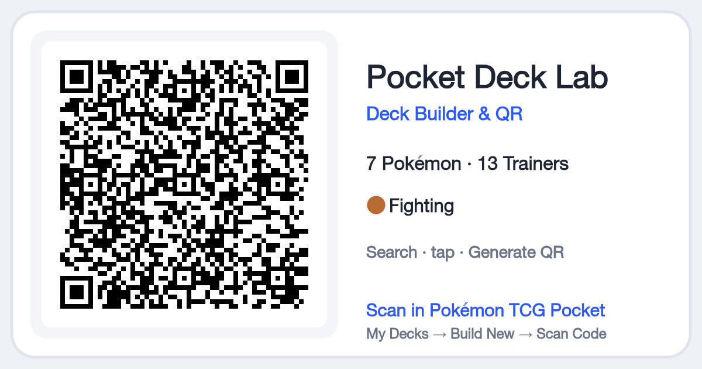

# Pocket Deck Lab

**Pokémon TCG Pocket Deck Builder & QR Generator**

Build a deck in seconds and get the QR code Pokémon TCG Pocket can scan, privately in your browser.

**[Open the app →](https://calerio.github.io/pokemon-tcg-pocket-deck-builder/)** · [How the QR format works](docs/qr-format.md)



## What it does

- **Search → tap → Generate QR.** Type a card name and tap it, or press Enter to add the top result. Every
  result has a `− n +` stepper, so you never open a modal to add a card.
- **Always know what's next.** An `n/20` counter and one message: *Add 4 more cards*, *Choose an energy*
  or *Ready to generate*. The 2-copies-per-name rule counts across different prints of a card.
- **QR codes the game reads.** Codes use the same QR version and error correction as the game's own. Plain
  codes and every QR-card design **have been scanned into the real game on iPhone**.
- **Collectible QR cards.** Save a card-shaped image (Clean, Cute or Energy theme, plus a social-post size)
  with the scannable code as its artwork.
- **Import anything.** Paste a Limitless decklist, a deck code or JSON, or scan or upload a screenshot of the
  game's own **Display Code** screen.
- **Nothing to lose.** Every change autosaves on your device, and an Undo toast follows every add or remove.

## Build your first deck (30 seconds)

1. Type a card name in the search box and tap the card, or press **Enter**.
2. Keep adding until the counter shows **20/20**.
3. Tap an **energy** under the counter. Dashed rings are suggestions from your cards' attacks.
4. Press **Generate QR**, then save the image or show it on screen.
5. In the game: **My Decks → Build New → Scan Code**.

## Privacy

Pocket Deck Lab has no server, accounts, analytics or cookies. Decks are stored in your browser's local
storage. Screenshots you import are decoded on your device and never uploaded. Card images load directly
from community image hosts (TCGdex and jsDelivr).

## Support and limitations

- **Tested with:** Safari/WebKit on macOS and iPhone-sized screens (automated); in-game import on iPhone of the
  plain QR, all QR-card themes and a 3-energy deck.
- **Still to verify:** Android, and Chrome/Firefox by hand. Automated tests run in WebKit only.
- **Deck codes carry cards and energy only.** Artwork, rarity, sleeves, covers and highlighted cards are
  chosen in the game.
- **Very new cards.** Cards from sets not yet in the community database can't be added until the data
  updates. A few promos show "limited data" (they still work in codes).
- **Screenshot reading** of the game's decorated codes is heuristic. A sharp, uncropped screenshot works best.

## How the QR format works

A deck code is Base64 of the card entity IDs plus your energy types. See [docs/qr-format.md](docs/qr-format.md).
**The format was reverse-engineered and documented by Kevin Gutowski in
[tcgp-deck-qr](https://github.com/KevinGutowski/tcgp-deck-qr).** Pocket Deck Lab is an independent,
MIT-licensed implementation of it, and its screenshot recovery is adapted from his (with credit).

## Development

```sh
npm install
npm run sync-data   # build public/data/cards.v1.json from the pinned card database
npm run dev         # http://localhost:5173/pokemon-tcg-pocket-deck-builder/
npm test            # unit + integration (Vitest, single worker)
npm run lint && npm run typecheck
npm run build       # production build + size budget check
npx playwright install webkit && npm run test:e2e   # end-to-end, WebKit only
```

Architecture: [docs/architecture.md](docs/architecture.md) · Data sources and licences:
[docs/data-sources.md](docs/data-sources.md) · UX benchmark: [docs/ux-benchmark.md](docs/ux-benchmark.md).
Pushes to `main` deploy to GitHub Pages via `.github/workflows/pages.yml`.

## Roadmap

- **v1.1:** side-by-side deck comparison built on transparent, explainable facts (shared cards, ratios,
  energy needs, setup risks).
- **Later, experimental:** a deterministic rules engine and simulator. See [docs/simulator-rfc.md](docs/simulator-rfc.md).
  Nothing like it exists here yet.

Contributions are welcome. See [CONTRIBUTING.md](CONTRIBUTING.md).

## Data, credits and licences

- Code: [MIT](LICENSE). Third-party notices: [THIRD_PARTY_NOTICES.md](THIRD_PARTY_NOTICES.md).
- Card identities and entity IDs: [flibustier/pokemon-tcg-pocket-database](https://github.com/flibustier/pokemon-tcg-pocket-database) (MIT).
- Card details: [TCGdex](https://tcgdex.dev) (MIT) and the [Limitless Pocket database](https://pocket.limitlesstcg.com/cards).
- Deck-code format: [KevinGutowski/tcgp-deck-qr](https://github.com/KevinGutowski/tcgp-deck-qr) (MIT).

*Pocket Deck Lab is an unofficial fan project. It is not affiliated with, endorsed, sponsored or approved by
The Pokémon Company, Nintendo, Creatures Inc., GAME FREAK inc. or DeNA Co., Ltd. Pokémon names, card text and
card images are © their respective owners. Card images are not hosted in this repository.*
